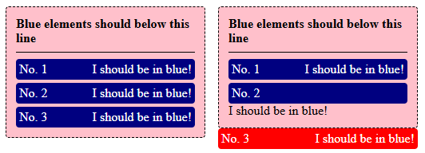

# StencilJS Issue

Demo project for showcasing an issue with Stencil slotting

## Setup

Use the following command:

- `nmp i`
- `npm run build`

## Reproducing The Bug

Open the file `./src/html/index.html` in Chrome, Edge or Firefox on a Windows machine, with a moderate CPU. The site renders two web-components quite a few times to increase the chance of the bug happening. Should it not occur, simply refresh the page.

We were not able to reproduce this on any M-series Mac!

Each rendered item is expected to loook like this:

If the bug occurs, some parts will not be slotted in correctly, see:

